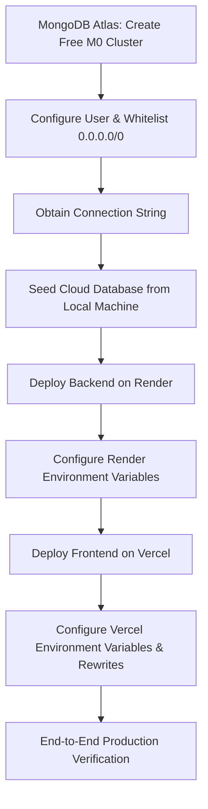

# 🚀 Production Deployment & MongoDB Atlas Integration Plan

This implementation plan details the step-by-step strategy to provision a production-grade cloud MongoDB database and deploy the Smart Leads Dashboard to cloud platforms (Render for Backend, Vercel for Frontend).

---

## 1. Goal Description
Transition the local Smart Leads Dashboard application into a fully deployed, highly secure production system with a hosted database (MongoDB Atlas) and cloud hosting providers.

---

## 2. User Review Required

> [!IMPORTANT]
> **Action Required from User during execution:**
> 1. Create free accounts on [MongoDB Atlas](https://www.mongodb.com/cloud/atlas), [Render](https://render.com), and [Vercel](https://vercel.com).
> 2. You will need to copy the Connection String from MongoDB Atlas and paste it into the deployment configurations.
> 3. Add `0.0.0.0/0` (allow all IPs) to your MongoDB Atlas Network Access list temporarily so Render's dynamic outbound IPs can connect.

---

## 3. Proposed Changes & Steps



### Phase 1: MongoDB Atlas Cloud Setup (Database Provisioning)
1. **Provision Free Cluster**: Create a free Shared `M0` cluster in MongoDB Atlas (e.g., hosted on AWS in your closest region).
2. **Create Database User**: Create a user with database read/write permissions (e.g., username `db-admin`, password auto-generated).
3. **Configure Network Security**: Add `0.0.0.0/0` to the IP Access List to allow incoming traffic from cloud servers with dynamic IP addresses (like Render).
4. **Obtain Connection String**: Copy the Node.js driver connection string. It will look like this:
   `mongodb+srv://<username>:<password>@<cluster-url>/smart-leads?retryWrites=true&w=majority`

### Phase 2: Seeding the Cloud Database
1. **Local Configuration**: Temporarily update the local `.env` file's `MONGODB_URI` with the new production Atlas connection string.
2. **Execute Seeding**: Run `npm run seed` inside the `server/` directory on your local machine to populate the Atlas cluster with the 20 leads and the 2 initial users (Admin and Sales).
3. **Verify**: Ensure the seed script completes successfully and disconnects.

### Phase 3: Backend Deployment (Render)
1. **Repository Setup**: Push the project repository to your GitHub account (monorepo structure).
2. **Create Web Service**: In the Render dashboard, create a new "Web Service" connected to your GitHub repository.
3. **Deployment Settings**:
   *   **Root Directory**: `server`
   *   **Build Command**: `npm install && npm run build`
   *   **Start Command**: `node dist/server/src/app.js`
4. **Environment Variables**: Add the following keys in Render's Env settings:
   *   `PORT`: `5000`
   *   `MONGODB_URI`: *[Your MongoDB Atlas Connection String]*
   *   `JWT_SECRET`: *[A new, secure 32+ character random string]*
   *   `NODE_ENV`: `production`
   *   `CORS_ORIGIN`: *[Your Vercel Frontend URL (to be updated after frontend deployment)]*

### Phase 4: Frontend Deployment (Vercel)
1. **Create Vercel Project**: Import the same GitHub repository in Vercel.
2. **Configure Settings**:
   *   **Root Directory**: `client`
   *   **Framework Preset**: `Vite`
   *   **Build Command**: `npm run build`
   *   **Output Directory**: `dist`
3. **Production API Endpoint routing**:
   *   Create a `vercel.json` file in the `client/` folder to set up clean API rewrites and redirect `/api/*` requests directly to your Render backend URL.
4. **Environment Variables**: Add in Vercel settings:
   *   `VITE_API_URL`: `https://your-render-backend-url.onrender.com/api/v1`

---

## 4. Specific Code Additions for Production

### [NEW] `vercel.json` (inside `client/`)
This file ensures clean proxying of API requests and resolves potential CORS issues on the frontend.
```json
{
  "rewrites": [
    {
      "source": "/api/:path*",
      "destination": "https://your-render-backend-url.onrender.com/api/:path*"
    }
  ]
}
```

### [MODIFY] `server/src/app.ts` & CORS Setup
Verify our CORS middleware accepts credentials and dynamically matches the production URL:
```typescript
app.use(
  cors({
    origin: env.CORS_ORIGIN,
    credentials: true,
  })
);
```

---

## 5. Verification Plan

### Manual Verification
1. **Health Checks**: Access `https://your-render-backend-url.onrender.com/health` and verify it returns a `200 OK`.
2. **Auth Flow**: Access your Vercel URL, register a new account, and check if it logs you in correctly.
3. **Real-time Database Check**: Verify that leads are loaded correctly from Atlas, and newly added leads persist on reload.
4. **Cookie Security**: Inspect the browser DevTools under "Application" -> "Cookies" and verify the `refreshToken` cookie has the `Secure`, `HttpOnly`, and `SameSite=Strict` flags checked.
